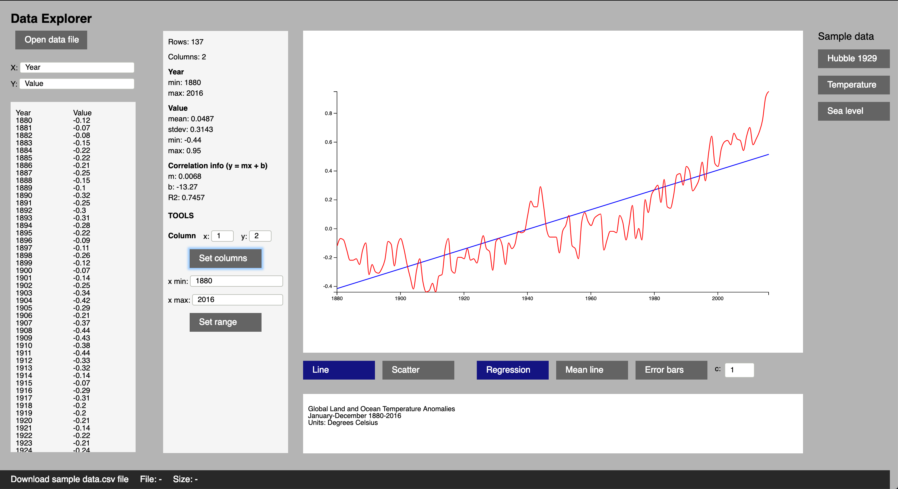
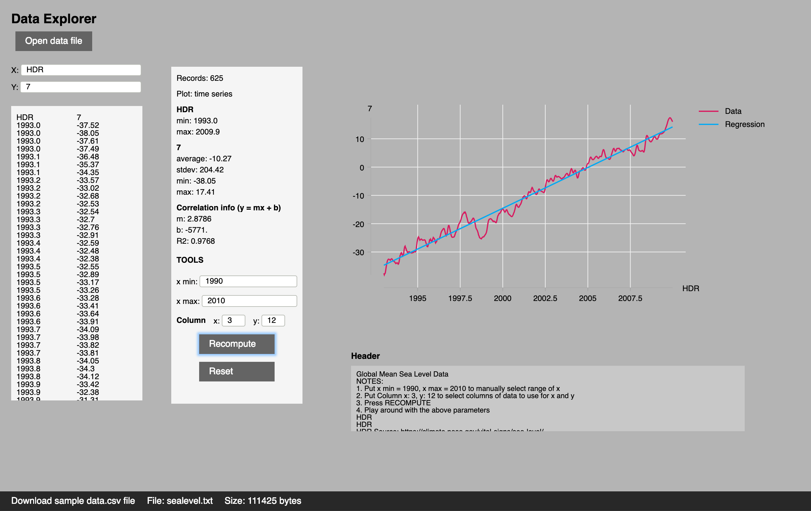

# Elm-stat





The `elm-stat` package provides tools for statistics and visualization of n-column data files.  Some features of the package are  exposed in the [Demo App](https://jxxcarlson.github.io/app/dataviewer.html),  the code for which is in `./examples` of this repo.  The package is intended to be a long-term research and development effort which will gradually add features over time.  I'd be very interested in finding collaborators with some background in mathematics and/or statistics.  The API has been evolving rapidly and will probably continue to do so for a while as I gain experience with it.


**Images.** The first image above displays an analysis of time series data from a csv file (temperature anomaly data versus time). The second displays time series data from a 100K space delimited file (sealevel rise data from NASA).

## The API

The `elm-stat` package consists of are four modules,

- `RawData`, for extracting raw data from a text string or file: metadata such as comments about the data, column headings, and an *mxn* table of strings representing the actual data.
- `Data`, defines the `Point` and `Data = List Point` types
- `Stat`,  for computing statistics of 1-D and 2-D data, e.g. means and regression lines
- `ErrorBar`, for computing error bars

There is also a module `SampleData` with some test data. Let's import the above modules to see how some of this works.  For more details, see the documentation for the individual modules.

First, some test data:

```
> SampleData.temperature
  """
  Global Land and Ocean Temperature Anomalies
  January-December 1880-2016
  Units: Degrees Celsius
  Base Period: 1901-2000
  Missing: -999
    Year   Value
    1880   -0.12
    1881   -0.07
    1882   -0.08
    1883   -0.15
    ...
```

Transform this text to a RawData value using `RawData.get`, a function which automatically detects the type of data represented by the text: space-delimited, tab-delimited, or comma-delimited (csv).

```
> RawData.get SampleData.temperature
  Just {
    columnHeaders = ["Year","Value"]
  , data = [["1880","-0.12"],["1881","-0.07"],["1882","-0.08"], ...
  , metadata = [
      "Global Land and Ocean Temperature Anomalies"
     , "January-December 1880-2016"
     , "Units: Degrees Celsius"
    ]
```

Pipe this computation into `getData 0 1` to extract a list of points:

```
> RawData.get SampleData.temperature |> Maybe.andThen (Data.get 0 1) |> Maybe.map (List.take 2)
  Just [{ x = 1880, y = -0.12 },{ x = 1881, y = -0.07 }, ...]
    : Maybe (List Point)
```


Statistics can be computed rom a `Data = List Point` value:

```
> data = get SampleData.temperature
  |> Maybe.andThen (getData 0 1)
  |> Maybe.withDefault []

> Stat.mean .x data
  Just 1948 : Maybe Float

> Stat.mean .y data
  Just 0.04875912408759121 : Maybe Float
```

The `statistics` function computes a package of statistical measures, including left and right endpoints for the regression line for the data.  These can be used to superimpose the regression line on the plot of the data.  

```
> Stat.statistics data
  Just { b = -13.276, leftDataPoint = { x = 1880, y = -0.12 }
       , leftRegressionPoint = { x = 1880, y = -0.416 }, m = 0.0068
       , n = 137, r2 = 0.7458, rightDataPoint = { x = 2016, y = 0.95 }
       , rightRegressionPoint = { x = 2016, y = 0.514  }, xMax = 2016
       , xMean = 1948, xMin = 1880, xStdev = 39.693, yMean = 0.0488
       , yStdev = 0.314 }
    : Maybe Statistics
```

## The Demo App

Code for the demo app is in `./examples`.  There is an online version at [Data explorer](https://jxxcarlson.github.io/app/dataviewer.html).

The data used in the example in the file `data/temperature-anomalies.csv` in this repo. It is a list of global temperature anomalies for the period 1880-2017 from [www.climate.gov](http://www.climate.gov). The annual temperature anomaly is the difference between the global mean temperature and the long-term mean global temperature. For this data set, the long-term mean is computed for the period 1901-2000.
